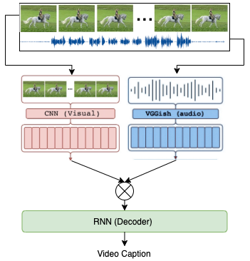
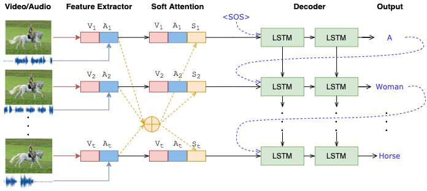

______________________________________________________________________

<div align="center">

# Multimodal Video Captioning 

<a href="https://pytorch.org/get-started/locally/"></a>
[](https://opensource.org/licenses/MIT)
[](docs/Hector_Martel-Chua_Khang_Hui-Final_report.pdf)

<!-- <a href="https://pytorch.org/get-started/locally/"></a> -->
</div>

## Project description

This repository contains the code for the Final Project of the Natural Language Processing course at Tsinghua University, Spring 2021.

In this project, we have developed a Deep Learning model to generate a description of a short video clip using a single sentence in English. The model architecture consists of a Visual CNN encoder and a [pre-trained VGGish audio encoder](https://github.com/harritaylor/torchvggish), followed by Soft Attention for multi-modal fusion and a LSTM sentence decoder. The design choices are inspired by [RecNet](https://github.com/hobincar/RecNet). The output is a sequence of words that represent the content of the input video. The full architecture is illustrated below:

<div align="center">

<!--  -->


</div>

Please refer to the [project report](docs/Hector_Martel-Chua_Khang_Hui-Final_report.pdf) for more specific details about the architecture, training procedures and results.


## Environment setup

First, clone the repository in your local machine by running this command:

```bash
git clone https://github.com/hmartelb/multimodal-video-captioning
cd multimodal-video-captioning
```

Make sure that you have Python 3 installed in your system. Also, Pytorch 1.5 or above needs to be installed. Check the [official installation guide](https://pytorch.org/get-started/locally/) to set it up according to your system requirements and CUDA version.

It is recommended to create a virtual environment to install the dependencies. Open a new terminal in the master directory, activate the virtual environment and install the dependencies from ``requirements.txt`` by executing this command:

```bash
(venv) pip install -r requirements.txt
```

## Data preparation

Download the MSVD and MSR-VTT datasets and place them in the `datasets/` folder. The code expects the datasets to have following structure: 

```
<dataset name>/
    audios/
        video1.wav
        ...
        videoN.wav
    features/
        audio/
        video/
    metadata/
        train.csv
        val.csv
        test.csv
    videos/
        video1.mp4
        ...
        videoN.mp4
```

Some folders inside `features/*` will be empty, and its contents will be generated after the *feature extraction* process.

> In case of the MSVD dataset, it is necessary to run the `download_youtube.py` script before to obtain the audio data.

## Feature extraction

After donwloading the data, we need to compute the features for each video and audio clip. 

```
(venv) python extract_features.py   --dataset <path_to_dataset_root>
                                    [--gpu <device_id>]
```

When the feature extraction finishes, the folders `features/audio` and `features/video` should contain 1 `.npy` file for each video in the dataset, with the same name as the original.

## Model training

To train a model, run the script `train.py` with the appropriate command line arguments, as follows:

```
(venv) train.py   --dataset 'MSVD' or 'MSR-VTT'
                    [--epochs <integer> (default, 50)]
                    [--batch_size <integer> (default, 128)]
                    [--lr <float> (default, 1e-4)]
                    [--gpu <device_id>] 
```

Modify the experiment configuration inside of the script and adapt it to your own needs. An array of experiments can also be used to run sequentially, one after the other, for conveninence.

## Evaluation
<!-- Clone evaluation codes from [python3 coco-evaluation repo](https://github.com/daqingliu/coco-caption) and copy them in the `pycocoevalcap/` folder. -->

<!-- **It is important to perform this step before training**, since the training script relies on the evaluation metrics for validation.  -->

When the training has finished, evaluate the results by loading an existing model checkpoint, as follows: 
1. Execute the notebook in `notebooks/predict_captions.py`. 
2. The results will be saved to the folder `results/<dataset_name>` in `.csv` format with 1 file per model, containing the generated captions and ground truth captions. 
3. Run the evaluation of `pycocoevalcap/` on the generated captions to obtain the objective scores for the model.

## Acknowledgements

* The code borrows the LSTM and reconstructor architectures from the [original RecNet implementation](https://github.com/hobincar/RecNet), which has been adapted to our multi-modal problem. 

* The VGGish model used for audio feature extraction is from [this PyTorch implementation](https://github.com/harritaylor/torchvggish).

## License 

This code implementation is licensed under the terms of the MIT License.

```
MIT License
Copyright (c) 2021 Héctor Martel, Chua Khang Hui
Master in Advanced Computing, Tsinghua University

Permission is hereby granted, free of charge, to any person obtaining a copy
of this software and associated documentation files (the "Software"), to deal
in the Software without restriction, including without limitation the rights
to use, copy, modify, merge, publish, distribute, sublicense, and/or sell
copies of the Software, and to permit persons to whom the Software is
furnished to do so, subject to the following conditions:

The above copyright notice and this permission notice shall be included in all
copies or substantial portions of the Software.

THE SOFTWARE IS PROVIDED "AS IS", WITHOUT WARRANTY OF ANY KIND, EXPRESS OR
IMPLIED, INCLUDING BUT NOT LIMITED TO THE WARRANTIES OF MERCHANTABILITY,
FITNESS FOR A PARTICULAR PURPOSE AND NONINFRINGEMENT. IN NO EVENT SHALL THE
AUTHORS OR COPYRIGHT HOLDERS BE LIABLE FOR ANY CLAIM, DAMAGES OR OTHER
LIABILITY, WHETHER IN AN ACTION OF CONTRACT, TORT OR OTHERWISE, ARISING FROM,
OUT OF OR IN CONNECTION WITH THE SOFTWARE OR THE USE OR OTHER DEALINGS IN THE
SOFTWARE.
```
